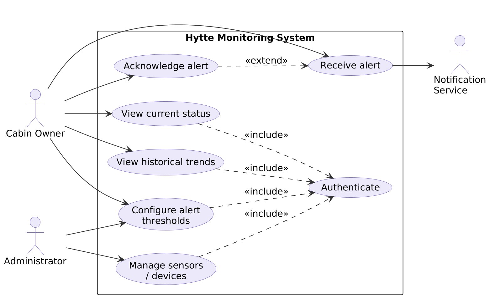
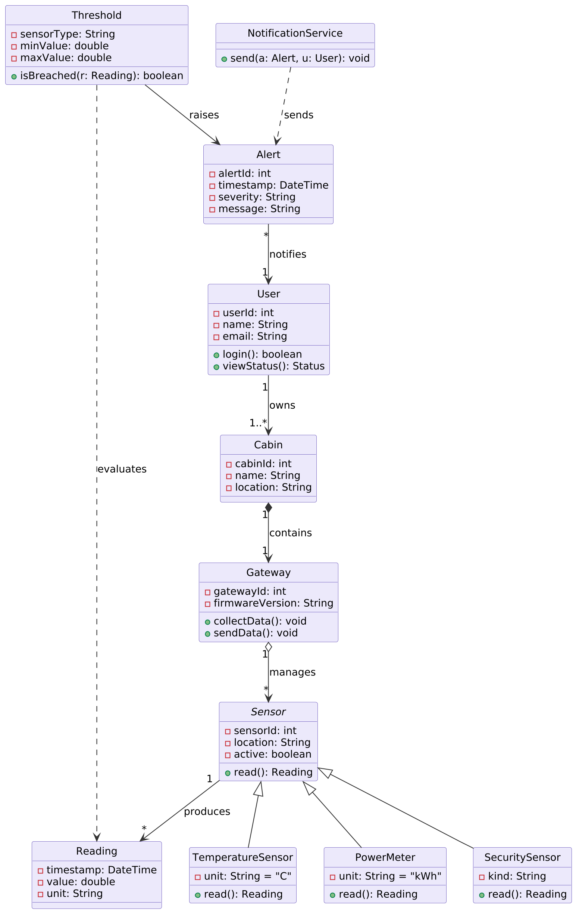
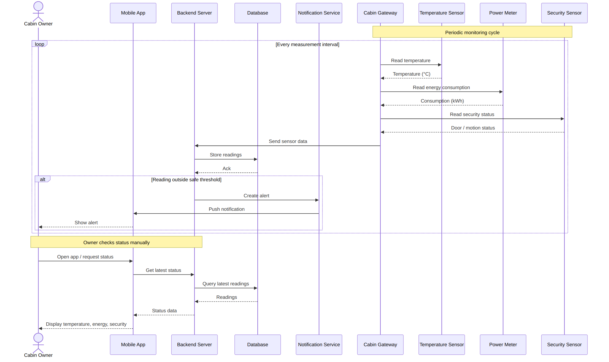
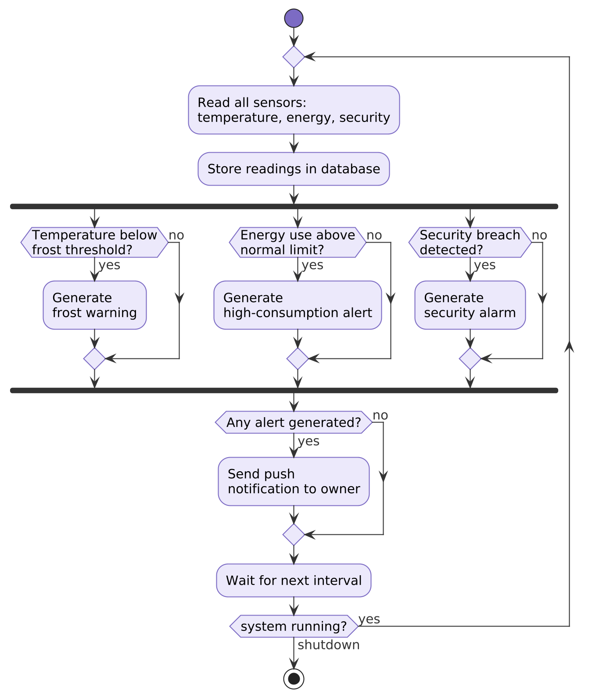
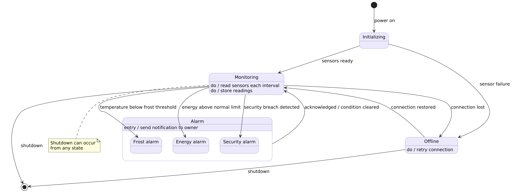

# System Diagrams — Hytte Monitoring

UML models of the hytte monitoring system, covering three monitored concerns:
**temperature (inside)**, **energy consumption**, and **security**.

Each diagram has an editable source file (`.puml` or `.mmd`) and a rendered
`.png`. The images below are what render on GitHub; see
[Regenerating the diagrams](#regenerating-the-diagrams) to rebuild them after
editing a source file.

## System components

| Component | Role |
|-----------|------|
| Cabin Owner | End user; receives alerts and checks status. |
| Mobile App | Client that displays data and shows notifications. |
| Backend Server | Receives readings, evaluates thresholds, and serves data. |
| Database | Stores sensor readings. |
| Notification Service | Delivers push notifications to the owner. |
| Cabin Gateway | Embedded device in the cabin; polls the sensors and reports in. |
| Temperature Sensor | Measures the inside temperature. |
| Power Meter | Measures energy consumption. |
| Security Sensor | Door / motion detection. |

## Use case diagram

What the system does from the outside — the goals each actor can achieve.
Shows `«include»` (a required sub-step, e.g. Authenticate) and `«extend»`
(optional behaviour, e.g. Acknowledge alert). Source: [`usecase.puml`](usecase.puml)



## Class diagram

The system's structure: classes, their attributes and methods, and their
relationships — inheritance (Sensor subtypes), composition (Cabin–Gateway),
aggregation (Gateway–Sensor), and associations with multiplicities.
Source: [`classdiagram.puml`](classdiagram.puml)



## Sequence diagram

How the components interact over time during a monitoring cycle and a manual
status check. The `loop` repeats each interval; the `alt` fragment sends an
alert only when a reading is out of range. Source: [`sequence.mmd`](sequence.mmd)



## Activity diagram

The decision logic of a single monitoring cycle. The flow forks (the solid bar)
into three parallel, independent checks, joins again, and sends one notification
if any alert was raised. Source: [`activity.puml`](activity.puml)



## State machine diagram

The operating modes of the system and the events that move it between them,
including a composite `Alarm` state with one sub-state per concern.
Source: [`statemachine.puml`](statemachine.puml)



## Regenerating the diagrams

Four diagrams use **PlantUML** and one (the sequence diagram) uses **Mermaid**.
GitHub renders Mermaid natively but not PlantUML, which is why every diagram is
committed as a `.png` and embedded above.

**PlantUML** (needs Java and `plantuml.jar`):

```bash
java -jar plantuml.jar -tpng usecase.puml classdiagram.puml activity.puml statemachine.puml
```

**Mermaid** (needs `@mermaid-js/mermaid-cli`):

```bash
mmdc -i sequence.mmd -o sequence.png -b white -s 3
```

## Diagram types at a glance

- **Structural** (what the system *is*): class diagram.
- **Behavioural** (what the system *does*): use case, sequence, activity, state machine.
